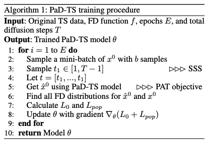
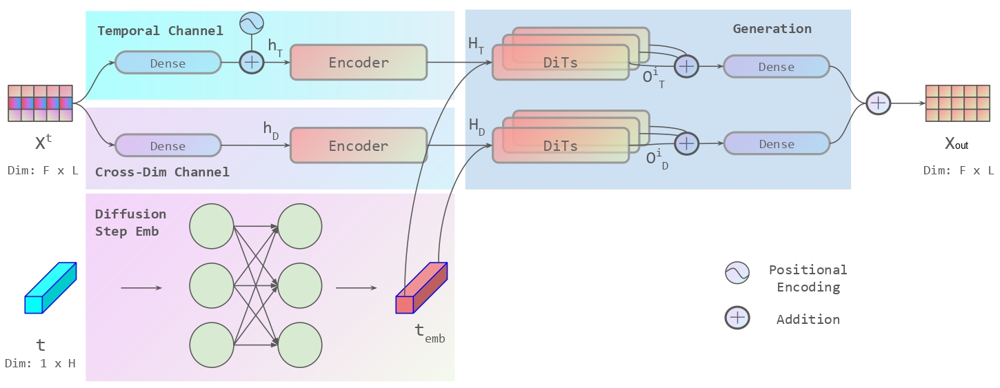
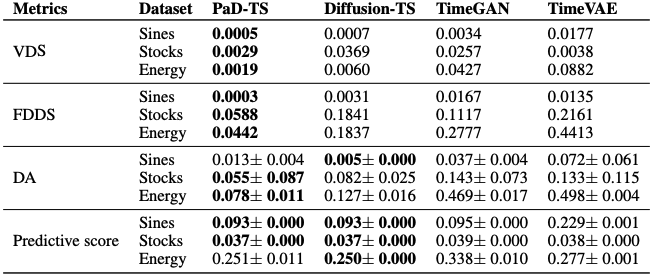
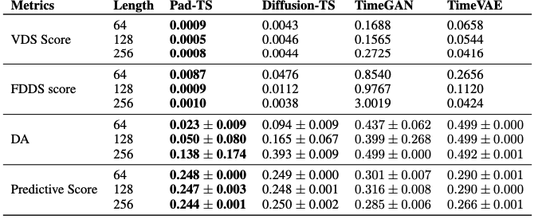

# PaD-TS


<p align="center">
  <a href="https://github.com/Trustworthy-AI-Group/TransferAttack/stargazers"> </a>
  [](https://arxiv.org/abs/2501.00910)
</p>


The repo is the official implementation for the paper: [Population Aware Diffusion for Time Series Generation](https://arxiv.org/abs/2501.00910).

**P**opulation-**a**ware **D**iffusion for **T**ime **S**eries **(PaD-TS)** is a new TS generation model that better preserves the population-level properties. The key novelties of PaD-TS include 1) a new training method explicitly incorporating TS population-level property preservation, and 2) a new dual-channel encoder model architecture that better captures the TS data structure.


## Training and Architecture 
### PaD-TS training
<p align="center">

</p>


### Dual-Channel Model Architecture
<p align="center">

</p>


## Setup & Experiments 
Environment setup.
```
$ conda env create --name PaD-TS --file=PaD-TS.yml
$ conda activate PaD-TS
```
Running experiment
```bash
$ python run.py -d {name} >& results/{name}.txt
```

## Results
TS generation results with generation length 24 for Sines, Stocks, and Energy datasets. **Bold** font (lower score) indicates the best performance.

<p align="center">

</p>

Long TS Generation Results on Energy dataset. **Bold** font (lower score) indicates the best performance.
<p align="center">

</p>

## Citation
If you find this repo useful, please cite our paper!

```
@article{Li_Meng_Bi_Urnes_Chen_2025,
  title={Population Aware Diffusion for Time Series Generation},
  volume={39},
  url={https://ojs.aaai.org/index.php/AAAI/article/view/34038},
  DOI={10.1609/aaai.v39i17.34038},
  number={17},
  journal={Proceedings of the AAAI Conference on Artificial Intelligence},
  author={Li, Yang and Meng, Han and Bi, Zhenyu and Urnes, Ingolv T. and Chen, Haipeng},
  year={2025},
  month={Apr.},
  pages={18520-18529}
}
```


## Code 
Thanks for the open sources papers listed below which PaD-TS is build on. 

https://github.com/openai/improved-diffusion/tree/main

https://github.com/thuml/iTransformer

https://github.com/facebookresearch/DiT

https://github.com/Y-debug-sys/Diffusion-TS

https://github.com/jsyoon0823/TimeGAN
